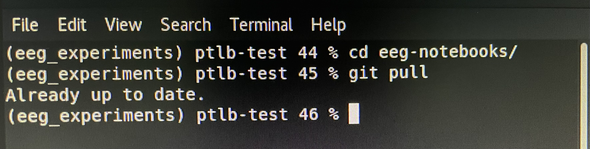
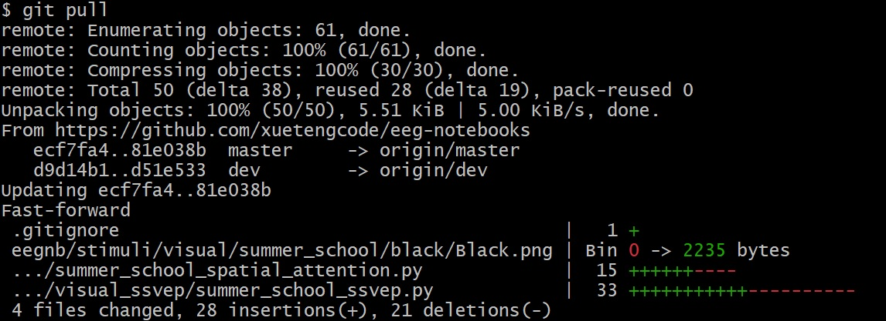
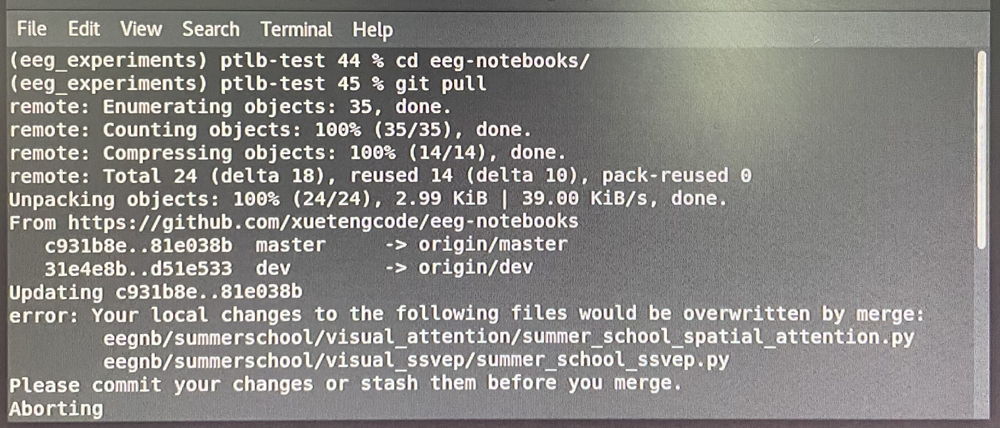
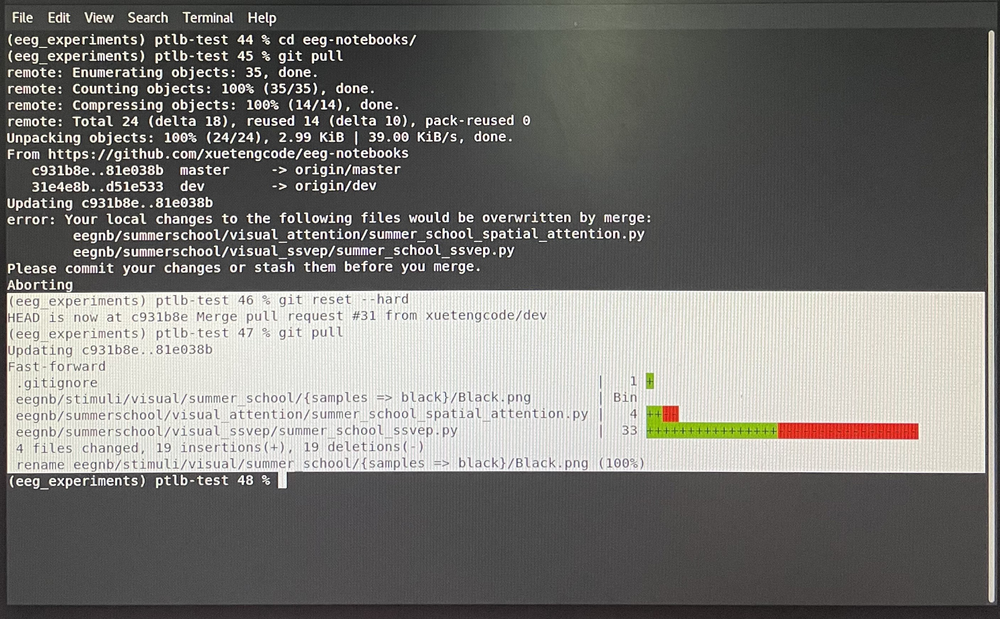
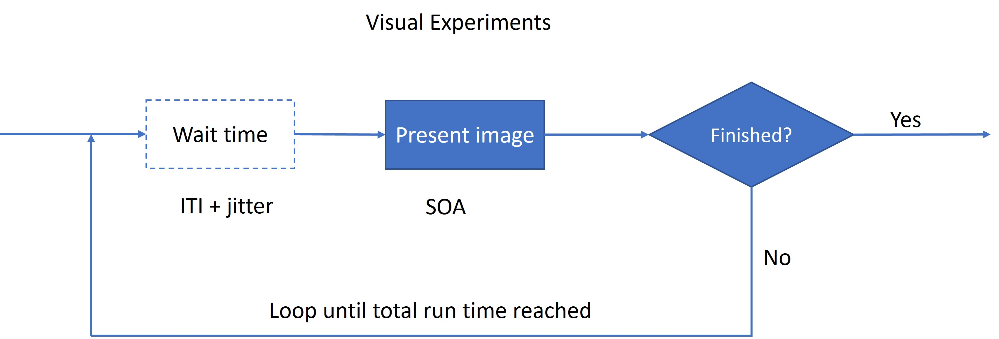

# Welcome to the modified eeg-notebooks
### Git Repository
https://github.com/xuetengcode/eeg-notebooks
### Additional Images
https://drive.google.com/drive/folders/1AH47OELX5T4rQJRl1mi9CsPDGDnLMFIu?usp=sharing
## Upon start
Open the terminal app and type:
```
cd eeg-notebook
git pull
```
The terminal should show either:

or:

If it shows an error message like this:

Then reset the git by running:
```
git reset --hard
git pull
```
Now it shows something similar to the selected text (white background) and you can proceed to "Run the experiment":



If you are on your personal computer:

```
conda create -y -n eeg_experiments python=3.7 wxpython
conda activate eeg_experiments
```
clone the modified package and install:
```
git clone https://github.com/xuetengcode/eeg-notebooks.git
cd <to eeg-nootbooks folder>
pip install -e .
```

## Run the experiment
In the terminal, type:
```
eegnb runexp -ip
```
Then turn on your device:

Muse - short press once on the button to turn on. Press and hold to turn off.

Unicorn - press and hold the power button until the light starts to blink, same way to turn off.


Now you select the device in the terminal:

Muse 2 - `6`

Muse s - `8`

Unicorn - `13`

Then you select Experiments that start with "Summer_School", e.g., `6 - Summer_School_N170`

## Modify the experiment
Experiment codes are located at `~\eeg-notebooks\eegnb\summerschool\`
Go to summer_school_[experiment name], the file name of each experiment is: summer_school_[experiment name].py, e.g., `summer_school_visual_n170` --> `summer_school_n170.py`

In the experiment code, you can change the parameters to make your own experiment:

`SOA` - the duration of showing each image;

`ITI` - the wait time between showings;

`images` - stimulus categories. You can change or delete the image categories, e.g., `faces` --> `cats`. Image folders are located at `~\eeg-notebooks\eegnb\stimuli\visual\summer_school`, you can add new categories by adding new folders of images at this location;

`NTRIALS` - leave it as 2010;

`BACKGROUND_COLOR` - background color;

`FIXATION_COLOR` - fixation (dot in the middle) color;

`IMG_DISPLAY_SIZE` - image size on the screen;

`T_ARROW` (when applicable) - presentation time of the arrow;

`update_freq` (when applicable) - flickering frequency;

`x_offset` (when applicable) - image location, horizontal distance away from center of screen;

`y_offset` (when applicable) - image location, vertical distance away from center of screen.


## Collected Data

All data are saved at `~/.eegnb`. Click the top left corner `Activities` --> `Files` --> on the top tool bar, click the button with 3 short lines (Open Menu) --> select `Show Hidden Files`.

Alternatively you can run the bash script `link_data.sh` in eeg-notebook folder:
```
bash link_data.sh
```
It will create a symbolic link from the hidden data folder to `~/eegnb`

## Visualize the data
Open a new terminal window:
```
cd eeg-botebooks\eegnb\summerschool
jupyter notebook
```
Go to summer_school_[experiment name], then summer_school_[experiment name]_viz.ipnb. E.g., `summer_school_visual_n170` --> `summer_school_visual_n170_viz.ipnb`

Replace the subject ID # and session #, then on the menu select `Cell` --> `Run All`
